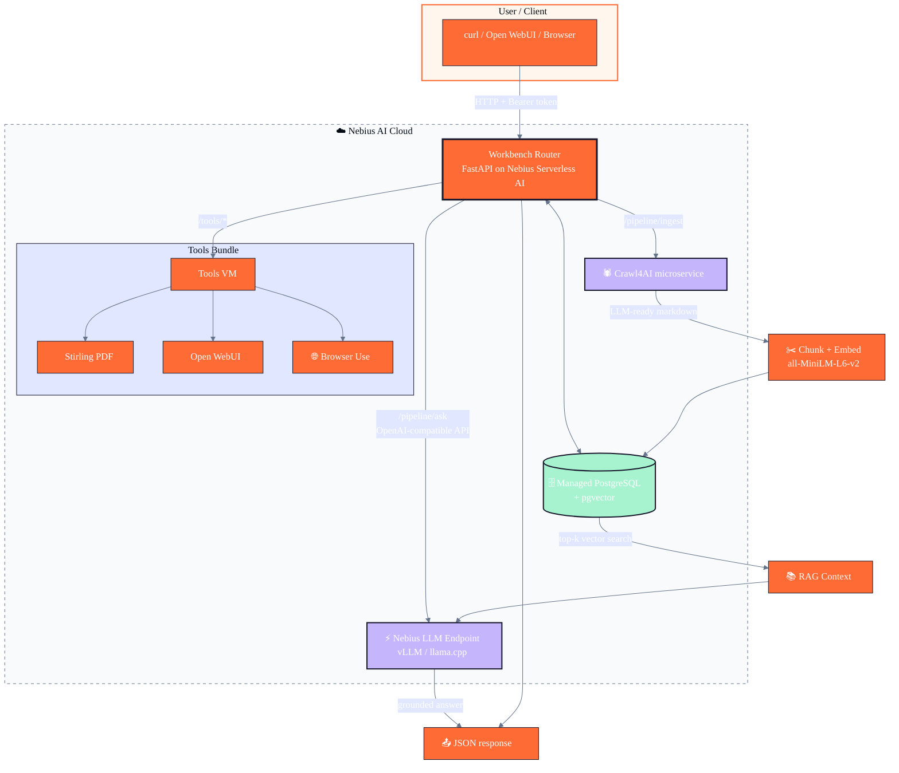

# Nebius 10-in-1 AI Workbench

[](https://nebius.com)
[](LICENSE)
[](https://www.python.org/)
[](https://www.docker.com/)

> **10 open-source AI tools wired into one serverless RAG workbench on Nebius AI Cloud.**

This project is a submission for the **Nebius Serverless AI Builders Challenge**. It shows how to combine a lightweight **FastAPI router**, a **managed PostgreSQL + pgvector** database, a **Nebius Serverless AI LLM endpoint**, and a dedicated **Crawl4AI microservice** into a reproducible, cost-aware AI workbench.

Live demo router: `http://<YOUR_ROUTER_IP>:8000`

---

## 🧰 The 10 tools

| # | Tool | Role in this project | Adapter route |
|---|---|------|---------------|
| 1 | **Langflow** | Visual builder for RAG / agent workflows | `/langflow` |
| 2 | **Browser Use** | AI browser agent for tasks like forms, clicks, login flows | `/browser-use` |
| 3 | **Open WebUI** | Self-hosted ChatGPT-style interface for the stack | `/open-webui` |
| 4 | **Supabase** | Postgres + pgvector backend for chunks, metadata and auth | `/supabase` |
| 5 | **Stirling PDF** | Self-hosted PDF conversion, OCR and redaction | `/tools/pdf/*` |
| 6 | **Coolify** | Self-hosting PaaS that deploys the updated router/frontends | `/coolify` |
| 7 | **Crawl4AI** | Async crawler that turns web pages into LLM-ready markdown | `/pipeline/ingest` |
| 8 | **OpenHands** | Autonomous coding agent that patches the pipeline | `/openhands` |
| 9 | **Maxun** | Point-and-click visual scraping workflows | `/maxun` |
| 10 | **Dify** | Platform to ship AI apps with workflows, agents and RAG | `/dify` |

---

## ⚡ What it does in 30 seconds

1. **`POST /pipeline/ingest`** — send any public URL.
2. The router calls **Crawl4AI** to fetch LLM-ready markdown.
3. Text is chunked, embedded with `sentence-transformers/all-MiniLM-L6-v2`, and stored in **managed PostgreSQL pgvector**.
4. **`POST /pipeline/ask`** — ask a question.
5. The router retrieves the most relevant chunks and sends them to a **Nebius Serverless AI Endpoint** running vLLM/llama.cpp.
6. The LLM returns an answer grounded in the retrieved context.

```bash
# ingest
curl -X POST http://<YOUR_ROUTER_IP>:8000/pipeline/ingest \
  -H "Authorization: Bearer $ROUTER_TOKEN" \
  -H "Content-Type: application/json" \
  -d '{"url":"https://docs.nebius.com/llms.txt","source":"nebius-llms"}'

# ask
curl -X POST http://<YOUR_ROUTER_IP>:8000/pipeline/ask \
  -H "Authorization: Bearer $ROUTER_TOKEN" \
  -H "Content-Type: application/json" \
  -d '{"question":"What AI services does Nebius offer?","top_k":2}'
```

---

## 🏗️ Architecture



---

## 🧱 Stack

| Layer | Technology |
|-------|-----------|
| **Router** | FastAPI + Uvicorn + Pydantic Settings |
| **Embeddings** | `sentence-transformers/all-MiniLM-L6-v2` (384-dim) |
| **Vector store** | Managed PostgreSQL with `pgvector` |
| **Crawler** | Crawl4AI + Playwright Chromium (microservice) |
| **LLM** | vLLM / llama.cpp on Nebius Serverless AI Endpoint (OpenAI-compatible) |
| **Container registry** | Nebius Container Registry |
| **Infra as code** | Nebius CLI + shell deploy scripts |

---

## 🚀 Quickstart

### Local

```bash
# 1. Clone
https://github.com/pyscalp/10in1-ai.git
cd 10in1-ai
python3 -m venv .venv
source .venv/bin/activate
pip install -r requirements.txt

# 2. Configure
cp .env.example .env  # edit as needed

# 3. Run minimal local stack
docker compose up -d

# 4. Start router
cd src/router
uvicorn main:app --host 0.0.0.0 --port 8000 --reload
```

Open [http://localhost:8000/docs](http://localhost:8000/docs) for the auto-generated OpenAPI UI.

### Deploy on Nebius Serverless AI

See [`docs/DEPLOYMENT_PLAN.md`](docs/DEPLOYMENT_PLAN.md) and [`docs/RUNBOOK.md`](docs/RUNBOOK.md) for the full, battle-tested deployment notes.

```bash
# build + push images
docker build -t <registry>/nebius10-crawl4ai:v1 -f Dockerfile.crawl4ai .
docker push <registry>/nebius10-crawl4ai:v1

docker build -t <registry>/nebius10-router:latest -f Dockerfile.router .
docker push <registry>/nebius10-router:latest

# deploy LLM, Crawl4AI, then Router
bash nebius/deploy-llm-cpu.sh
bash nebius/deploy-crawl4ai.sh <registry>/nebius10-crawl4ai:v1
bash nebius/deploy-router.sh <registry>/nebius10-router:latest
```

---

## 📊 Live demo commands

```bash
export ROUTER_IP=<YOUR_ROUTER_IP>:8000
export ROUTER_TOKEN=<your-router-token>

# Health check
curl -H "Authorization: Bearer $ROUTER_TOKEN" http://${ROUTER_IP}/health

# Ingest a URL
curl -X POST http://${ROUTER_IP}/pipeline/ingest \
  -H "Authorization: Bearer $ROUTER_TOKEN" \
  -H "Content-Type: application/json" \
  -d '{"url":"https://docs.nebius.com/llms.txt","source":"nebius-llms"}'

# Ask a question (RAG)
curl -X POST http://${ROUTER_IP}/pipeline/ask \
  -H "Authorization: Bearer $ROUTER_TOKEN" \
  -H "Content-Type: application/json" \
  -d '{"question":"What AI services does Nebius offer?","top_k":2}'
```

---

## 💰 Hardware / cost guidance

| Component | Platform / preset | Notes |
|-----------|-------------------|-------|
| LLM inference | Nebius Serverless AI Endpoint `cpu-d3` / `4vcpu-16gb` (or GPU for larger models) | boots ~2–5 min |
| Router | Nebius Serverless AI Endpoint `cpu-d3` / `4vcpu-16gb` | boots ~1 min |
| Crawl4AI | Nebius Serverless AI Endpoint `cpu-d3` / `4vcpu-16gb` | Chromium needs RAM |
| Tools VM | Nebius Compute Instance `cpu-d3` / `4vcpu-16gb` | Stirling PDF + Open WebUI |
| Vector DB | Managed PostgreSQL `b1.medium` or similar | pgvector enabled |

For the challenge, stop or delete endpoints between tests to keep credits low. See `docs/AGENT_LOG.md` for the latest resource audit.

---

## 📁 Repository layout

```text
.
├── Dockerfile.crawl4ai             # Crawl4AI microservice image
├── Dockerfile.llm-cpu              # llama.cpp CPU image
├── Dockerfile.router               # Workbench Router image
├── docker-compose.yml              # local stack
├── requirements.*.txt              # Python deps
├── src/
│   ├── router/                     # FastAPI orchestrator
│   └── crawl4ai_service/           # Crawl4AI microservice entrypoint
├── nebius/                         # deploy scripts for Nebius
├── docs/
│   ├── AGENT_LOG.md                # execution log & resource audit
│   ├── DEPLOYMENT_PLAN.md          # deployment walkthrough
│   ├── RUNBOOK.md                  # live endpoint reference
│   └── SUBMISSION.md               # challenge submission materials
├── blog/
│   └── BLOG.md                     # write-up for the challenge
└── notebooks/
    └── demo.ipynb                  # interactive smoke test
```

---

## 📄 License

MIT — see [LICENSE](./LICENSE).

Acknowledgements: this project integrates excellent open-source tools including Crawl4AI, Stirling PDF, Open WebUI, Langflow, Dify, Browser Use, Maxun, OpenHands, Coolify, and Supabase. Their respective licenses apply to their own code.
